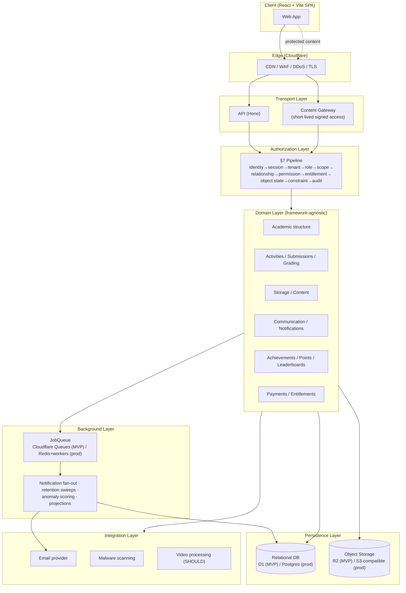
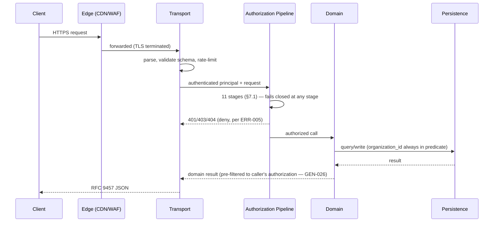
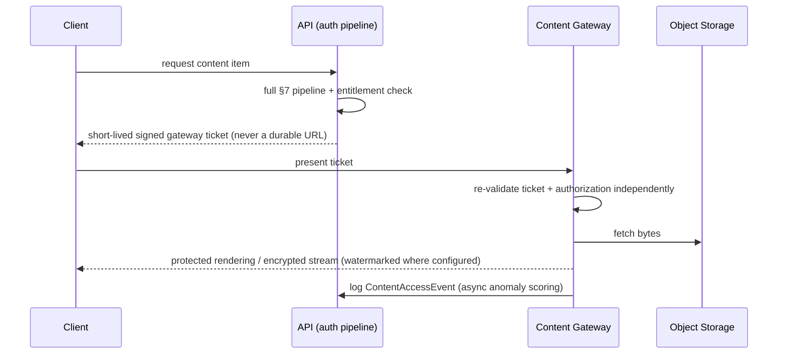
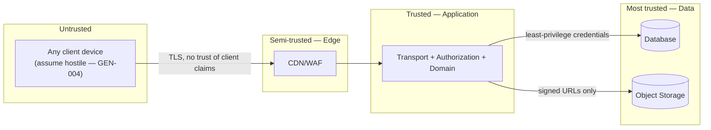

# System Architecture

**Phase:** 1 — System Architecture
**Status:** Approved. The backend/frontend stack (TypeScript, Hono, Drizzle ORM, React + Vite, and supporting tooling) was approved by the Project Owner on 2026-09-13, along with a binding portability directive — see `docs/decisions/05-phase1-decisions-pending-approval.md` and `docs/decisions/02-assumptions-register.md` §A (A-05..A-13). Scaffolding begins in Phase 2.
**Source:** SRS v1.3 (`docs/srs/`), Phase 0 outputs (`docs/decisions/`)

This is the entry point into the architecture documentation set:

- `README.md` (this file) — system overview, component diagram, data-flow diagram, module boundaries
- `backend.md` — layering, domain-layer design, background jobs, platform adapters
- `database.md` — physical database architecture (the logical model itself is normative in SRS §37 and is not re-derived here)
- `auth-and-authorization.md` — authentication architecture and the §7 authorization pipeline
- `storage-and-content.md` — Teacher Storage, publishing, and the Content Gateway
- `security-and-trust-boundaries.md` — trust boundaries, audit architecture, threat-model mapping
- `observability-and-deployment.md` — logging/metrics/tracing, deployment topology, backup/recovery, external integrations

## 1. What this architecture must be true of, regardless of any tool choice

These are fixed by the SRS (not decided here — see `docs/decisions/00-architecture-readiness-report.md` §1):

1. Every protected operation passes through **one** authorization pipeline (§7.1, 11 stages) — no endpoint may implement its own check.
2. Every scoped table carries `organization_id`, enforced at the query layer, not by application convention (GEN-019, DB-001).
3. Protected content is never served as a durable URL; it goes through a Content Gateway (§16, GEN-016/017).
4. Every platform primitive (object storage, queue, cache, mail, scheduler) sits behind an interface with ≥2 implementations exercised in CI (BE-008) — this is what makes the Cloudflare→VPS migration (§41.5) a configuration change, not a rewrite.
5. The domain layer (business rules) has zero compile-time dependency on the HTTP framework, database driver, or hosting platform (BE-002).
6. State machines (§45) are enforced server-side; an invalid transition is rejected (409/422), never merely hidden in the UI.

## 2. Component diagram

## 3. Data-flow diagram — the two paths every request takes

Ordinary API request:

Protected content request (level 2–3, §16):

## 4. Trust boundaries (summary — full detail in `security-and-trust-boundaries.md`)

The client is never trusted for role, scope, organization, or permission (SEC-004) — every claim it makes is re-verified server-side, even if the UI already hid the control (GEN-003).

## 5. Module boundaries

One module per SRS domain area, each owning its own migrations, its own domain logic, and its own tests. No module reaches into another module's tables directly — cross-module reads go through the other module's public interface, same discipline whether or not they end up in the same deployable process.

| Module | Owns (SRS prefixes) | Depends on |
|---|---|---|
| `identity` | ORG, User/UserProfile (§37.3.1) | — |
| `auth` | AUTH, AUD (sessions) | `identity` |
| `authz` | SEC, permission catalogue (§26) | `identity` |
| `academic-structure` | PER, CLS/GRP, SUB/CRS/CYC/TOP | `identity`, `authz` |
| `teaching-sessions` | SES | `academic-structure` |
| `storage` | STR | `identity`, `authz` |
| `content-gateway` | CNT | `storage`, `authz` |
| `question-bank` | QBN | `identity`, `authz`, `storage` |
| `activities` | ACT | `academic-structure`, `question-bank`, `content-gateway` |
| `submissions` | (ACT state, DB-013) | `activities` |
| `grading` | GRD, PRG | `submissions` |
| `assistant` / `parent` | AST, PAR | `authz`, `academic-structure` |
| `communication` | MSG | `identity`, `authz` |
| `notifications` / `calendar` | NOT, CAL | all modules (consumer only, via events) |
| `gamification` | ACH, PTS, LDB | `submissions`, `grading` |
| `payments` | PAY, BIL | `identity` |
| `admin` | ADM | all modules (oversight only, via `authz`) |

This is the same shape as the Phase → module map already recorded in `docs/decisions/03-implementation-roadmap.md`; this table is the authoritative version going forward — the roadmap should be read as "when," this table as "what depends on what."
