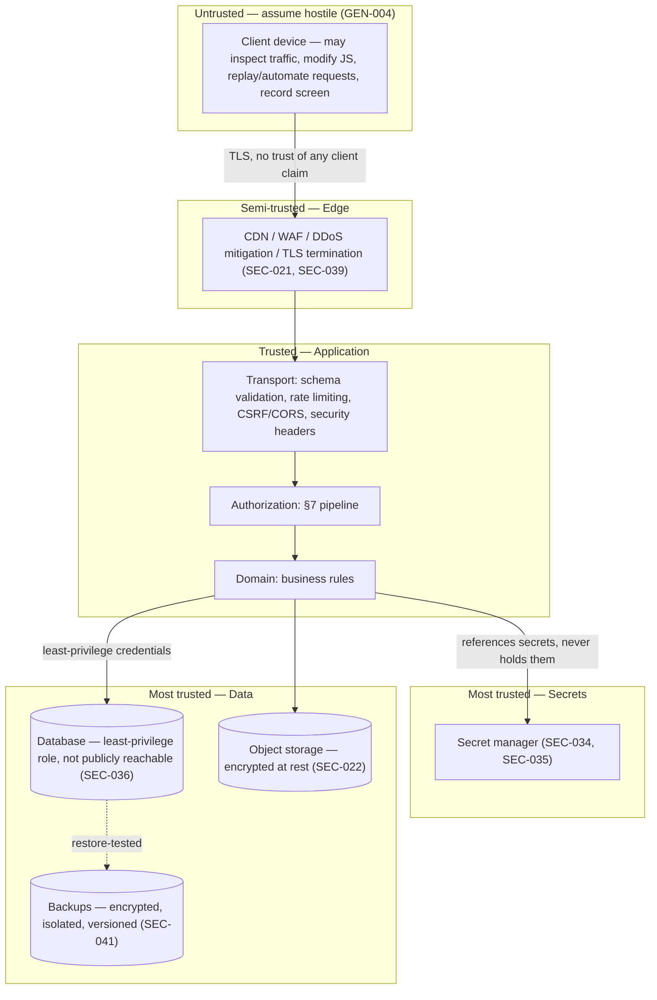

# Security & Trust Boundaries

**Source:** SRS §34 (Security Architecture), SEC-020..045, §34.3 Threat Model (Table 34.2), §34.4 Risk Priorities

This document maps the SRS's security requirements and named threat model onto the component/trust-boundary diagrams already introduced in `README.md` §§2–4. It does not restate `auth-and-authorization.md` (the §7 pipeline) or `storage-and-content.md` (the Content Gateway) — it covers the security controls that sit *around* those: transport, injection defense, secrets, infrastructure isolation, and the explicit threat-to-control mapping the SRS itself requires (§34.3).

## 1. Defense in depth — no single mechanism is trusted alone (§34 opening)

The security posture is layered deliberately: RBAC (role), scope-based authorization, object-level authorization, and entitlement are four independent checks (`auth-and-authorization.md` §§1–5), any one of which failing still leaves the others standing. This document adds the layers around that core: transport security, input validation, infrastructure isolation, and secrets management — each is a separate control, not a restatement of authorization in different words.

## 2. Trust boundaries (extending `README.md` §4)

Every arrow crossing a boundary is a point where the SRS requires re-verification, not a trust handoff: the client's claims about its own identity, role, or scope are never accepted (SEC-004, `auth-and-authorization.md` §6); the Edge terminates TLS but makes no authorization decisions (`README.md` §1.1); the application never embeds a secret in anything the client receives (SEC-034).

## 3. Transport and application-layer controls (SEC-021, SEC-026..029, SEC-037..038)

These are Transport-layer responsibilities (`backend.md` §1's layering table) with concrete SRS requirements behind them, not general best-practice reminders:

- **TLS everywhere, no exceptions** — HTTP redirects or is disabled (SEC-021); this is an Edge-layer configuration concern, not something any individual route implements.
- **No raw SQL from user input** — every query goes through parameterized queries or the ORM/data-access layer, never string-built (SEC-026); this is the same discipline that keeps the Persistence layer swappable between D1 and Postgres (`database.md` §1) — a hand-built SQL string is both an injection risk and a portability violation simultaneously.
- **Output encoding and CSP** for user-generated content (SEC-027) — sanitization happens at serialization, the same place API-007's authorization-projection filtering happens (`backend.md`'s referenced API principles), so both concerns are handled by one response-shaping step per endpoint rather than two independent ones that could drift.
- **CSRF protection wherever cookie-based auth is used** (SEC-028) and **CORS restricted to explicit allowed origins, never wildcard for authenticated APIs** (SEC-029).
- **Security headers as a Transport-layer default**, not opt-in per route: HSTS, CSP, `X-Content-Type-Options`, `Referrer-Policy`, clickjacking protection (SEC-038).
- **Production errors never leak internals** — no query text, stack trace, file path, secret, or infrastructure detail in an error response (SEC-037); this is the same RFC 9457 problem-detail contract `backend.md`'s error-mapping responsibility already names for the Transport layer, with the explicit constraint that the *content* of that response is scrubbed before serialization.

## 4. Input validation and file safety (SEC-025, SEC-033)

All external input — type, length, format, range, allowed values, relationships, file type and size — is validated before use (SEC-025); this is enforced at the Transport layer's schema-validation step (`backend.md` §1) so no domain-layer function ever has to defend against a malformed request shape. Uploaded files are validated and malware-scanned in quarantine before becoming available to any other user (SEC-033) — this is the same upload path already described in `storage-and-content.md` §3; it is listed here again only because it is also a §34 security control, not a duplicate design.

## 5. Secrets and encryption (SEC-022, SEC-034, SEC-035, SEC-023, SEC-024)

- Sensitive data is encrypted at rest across database, object storage, and backups (SEC-022).
- Secrets never live in source control, client bundles, or plaintext config — a secrets/key-management system is the only place they exist (SEC-034); this is a hard constraint on the environment-reproduction config the GitHub workflow rules already require (`.env.example` templates, never populated `.env` files, `docs/README.md`).
- Encryption keys have controlled access, defined rotation, and recovery procedures (SEC-035) — key management is deferred to Phase 25 (Disaster Recovery, per `docs/decisions/03-implementation-roadmap.md`) for concrete rotation tooling, but the architecture already requires keys to be referenced by the domain layer, never embedded in it.
- Passwords are hashed with a modern memory-hard algorithm (Argon2id preferred, bcrypt acceptable), unique salts, appropriate work factor (SEC-023) — never logged, never returned in any API response (SEC-024). This is enforced structurally by keeping `password_hash` out of every DTO the `identity`/`auth` modules return, not by a serialization filter added after the fact.

## 6. Infrastructure isolation (SEC-036, SEC-039, SEC-042)

- The database is never publicly reachable — only authorized application infrastructure connects, using least-privilege accounts (SEC-036); this is the database-role-level enforcement `database.md` §4 already names for audit tables, generalized here to the database connection itself.
- Backups are not directly internet-exposed, network segmentation applies, DDoS protection sits at the Edge (SEC-039) — this maps directly onto the Edge/Persistence separation already drawn in `README.md` §2's component diagram.
- Development and staging environments use synthetic or anonymized data, isolated from production credentials (SEC-042) — this constrains any seed/fixture data committed under `database/seeds/` (per the GitHub workflow rules) to be synthetic by construction, never a sanitized production export.

## 7. Rate limiting and abuse defense (SEC-031, SEC-032)

Rate limiting protects login, password reset, OTP, file upload, messaging, search, content delivery, and public endpoints — calibrated so legitimate users aren't easily locked out (SEC-031). Brute-force and credential-stuffing defense combines rate limiting, progressive delays, MFA, and suspicious-login detection (SEC-032) — this is the Transport-layer counterpart to the Content Gateway's own rate limiting (`storage-and-content.md` §10); the two are the same mechanism applied at two different layers (API-wide vs. content-specific), not two separate rate-limiter implementations.

## 8. Testing and dependency hygiene (SEC-040, SEC-045)

Dependencies are version-controlled, regularly updated, and vulnerability-scanned in CI (SEC-040) — this is a concrete GitHub Actions CI requirement (B-08 in the Assumptions Register, still pending approval) once the CI platform is confirmed. Security testing includes dependency scanning, static analysis, secret scanning, API security tests, and manual authorization/authentication/file-upload/multi-tenant-isolation testing (SEC-045) — this is Phase 23 scope (`docs/decisions/03-implementation-roadmap.md`), not implemented in Phase 1, but the CI pipeline design in Phase 2 should reserve the hooks for it (dependency-scan and secret-scan jobs) so Phase 23 is wiring existing gates rather than inventing a pipeline from scratch.

## 9. Incident response (SEC-043, SEC-044)

A documented incident-response process (detect → contain → investigate → eradicate → recover → review → improve) is a SRS requirement (SEC-043), and on suspected account compromise the system supports session revocation, credential reset, forced re-authentication, MFA enforcement, and audit review (SEC-044) — all of which are capabilities the `auth`/`authz` modules already expose per `auth-and-authorization.md` §2 (server-side revocation, AUTH-105/107/109), not new mechanisms. The incident-response *process document itself* is an operational deliverable, not architecture, and is out of Phase 1 scope.

## 10. Threat model → control mapping (§34.3, Table 34.2 — restated for traceability)

| Threat | Realistic form | Countered by | Where enforced in this architecture |
|---|---|---|---|
| IDOR/BOLA | Student changes an ID to read another student's grade/submission | GEN-025, SEC-005, SEC-009 | `auth-and-authorization.md` §6 — object-state stage checks the specific target, not the type |
| Horizontal escalation | Assistant reaches a class outside their assignment | GEN-006, AST-002 | `auth-and-authorization.md` §4 — SEC-014 relationship re-verification |
| Vertical escalation | Assistant self-grants permissions or becomes a Teacher | SEC-006, AST-004 | `auth-and-authorization.md` §6 — no privilege amplification |
| Unauthorized parent access | False parent claim, or a forwarded link code | PAR-002, LEG-005 | `auth-and-authorization.md` §4 — ACTIVE-only ParentLink re-verification |
| Answer-key disclosure | Student reads correct answers from a quiz API response | GEN-026, QBN-039 | Serialization-layer projection filtering, §3 above |
| Content theft | Bulk download/scraping of paid course | CNT-012..024, GEN-016 | `storage-and-content.md` §§6, 10 — Content Gateway + abuse detection |
| Storage enumeration | Guessing file identifiers/storage URLs | STR-015, CNT-012 | `database.md` §3 (non-guessable ids) + `storage-and-content.md` §6 (no durable URLs) |
| Cross-tenant leakage | One Organization reads another's data | ORG-003, SEC-020 | `database.md` §2 — schema + query-layer + unique-constraint enforcement |
| Session hijacking/fixation | Stolen or reused session credentials | AUTH-104, AUTH-110, AUTH-115, AUTH-119 | `auth-and-authorization.md` §2 |
| Credential attacks | Password reuse/stuffing against student accounts | SEC-023, SEC-032 | §5, §7 above |
| Grade tampering | A grade changed without trace | GRD-005, GRD-006, AUD-003 | `database.md` §6 (optimistic concurrency) + `auth-and-authorization.md` §8 (audit) |
| Malware upload | Malicious file distributed to a class | SEC-033, STR-007 | `storage-and-content.md` §3 |
| Insider access | Admin reads private records with no legitimate need | ADM-025, ADM-027, AUD-007 | `auth-and-authorization.md` §8 — AUD-007 high-severity audit on exceptional access |
| Data loss near a deadline | Submission lost during an outage | ACT-035, NFR-002 | `observability-and-deployment.md` (backup/recovery, deferred to that doc) |

Every row above is already addressed by an architectural mechanism defined in this document set — the table's purpose here is traceability (confirming Table 34.2's threat list has a named architectural home), not introducing new design.

## 11. Security risk priorities (§34.4) — what this means for build order

Critical-priority areas (authorization/access control, student privacy, parent-child relationships, authentication, database security, file access, grade integrity) are exactly the areas Phases 4–13 build first per the roadmap (`docs/decisions/03-implementation-roadmap.md`) — authentication (Phase 4) and authorization (Phase 5) are structurally first because every later phase depends on them, matching the SRS's own priority ordering, not a coincidence of the dependency graph.

## 12. What this document does not decide

The specific WAF/DDoS provider configuration, the concrete secret-manager product, CSP policy specifics (allowed script/style sources), and the incident-response runbook are operational/implementation decisions for Phase 2 (repo/CI/CD) and Phase 25 (Disaster Recovery) respectively — this document fixes only that these controls exist and where each lives in the layered architecture, per SRS SEC-021..045.
